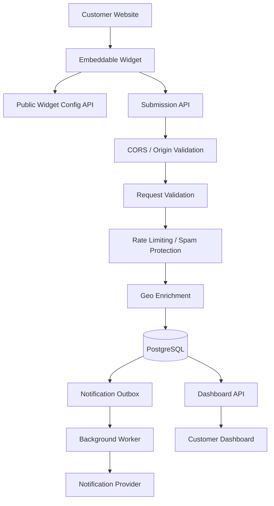

# System Architecture

## 1. Overview

This system lets customers add small interactive widgets to their websites. When a visitor fills out and submits one of these widgets, the system checks the data, adds extra info (like location), saves everything, and then sends out notifications in the background.

## 2. Architecture Diagram

## 3. Main Components

**Embeddable Widget**
A small piece of code that a customer adds to their website. It fetches the widget's settings and displays the right fields to visitors.

**Public Widget Configuration API**
Tells the widget what to display and how it should look. This is public-facing, so it's careful never to leak any private tenant (customer) information.

**Submission API**
Receives the data a visitor fills in and submits. This is where the request is checked for validity, screened for spam, optionally enriched with location data, and finally saved.

**CORS / Origin Validation**
Checks that the website sending a request is actually allowed to use the widget, based on the origins the customer has configured.

**Validation**
Makes sure the submitted data matches the fields the widget was set up to collect.

**Rate Limiting / Spam Protection**
Guards the public submission endpoint against bots, abuse, and excessive traffic.

**Geo Enrichment**
Tries to figure out the visitor's location and attach it to the submission. It first tries a primary provider, and if that fails, falls back to a secondary one. If both fail, the submission is still saved — just without location data.

**PostgreSQL**
The main database. It stores tenants, widgets, field definitions, widget-field settings, submissions, the values submitted for each field, and other application data.

**Notification Outbox**
A record created for each successfully saved submission, marking that a notification needs to be sent.

**Background Worker**
A separate process that handles sending notifications. It runs independently of the visitor's request and retries a limited number of times if a notification fails to send.

**Dashboard API**
Gives authenticated customers secure access to their own submissions and basic stats.

**Customer Dashboard**
The web interface where a logged-in customer can view their submissions and analytics.

## 4. Submission Flow

Here's what happens, step by step, when a visitor submits a widget:

1. The visitor fills out and submits the embedded widget.
2. The request hits the **Submission API**.
3. It goes through **validation and spam/abuse protection**.
4. The system attempts **geo enrichment** (location lookup).
5. Everything is saved together in a **single database transaction**:
   - The submission itself
   - The individual field values
   - A notification outbox entry
6. The visitor gets a **success response**.

Separately, in the background:

7. The **background worker** picks up the notification outbox entry.
8. It sends the notification through the **notification provider**.

**Important:** Sending the notification is not part of the visitor-facing flow. If a notification fails, it does **not** cause the submission itself to fail — the submission has already been saved successfully.

## 5. Tenant Isolation

Every customer (tenant) can only see and manage their own data. Authenticated dashboard and management actions are always scoped to the logged-in tenant — a tenant can never access another tenant's widgets, submissions, or analytics.

## 6. Failure Handling

The system is built so that problems with non-critical, external services don't break the core submission process. For example:

- **Geo provider A fails** → the system tries geo provider B.
- **Both geo providers fail** → the submission is still saved, just without location info.
- **Notification fails** → the submission is kept as-is, and the notification is retried later in the background (with a limited number of attempts).
- **Invalid submission** → the visitor gets an appropriate error response (4xx).

## 7. Data Model

The detailed data model (entities and relationships) is documented separately in `data-model.md`.

## 8. API Contracts

The full API endpoints and request/response formats are documented separately in `api.md`.