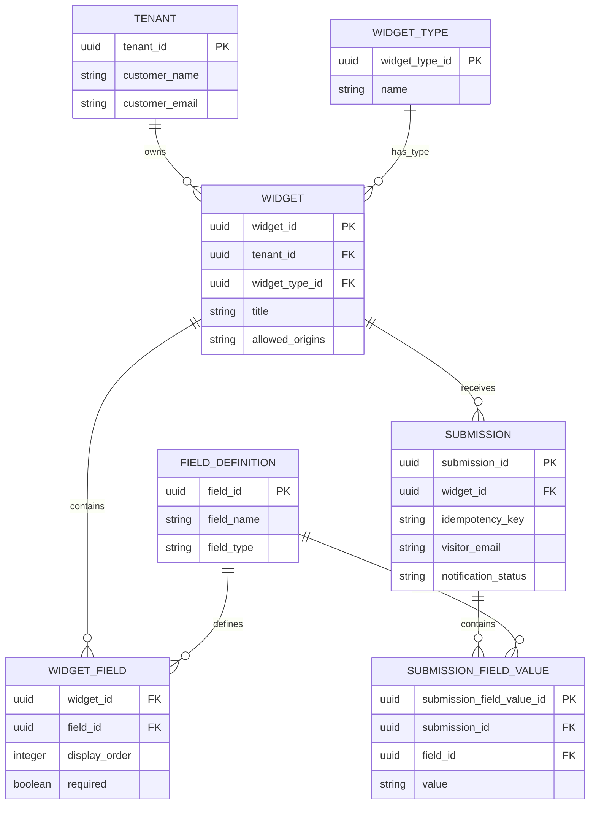

# Data Model

## Overview

This system uses a relational (SQL) data model to support a multi-tenant platform where each customer can build and embed their own widgets.

The model separates a few clear concepts:

- **Tenants** — the customers using the platform
- **Widgets** and their **types**
- **Field definitions** that can be reused
- **How a field is configured** for a specific widget
- **Submissions** received through a widget
- **Individual values** submitted for each field

## Entity Relationship Diagram



## Entities

### Tenant

A customer using the platform. One tenant can own many widgets.

| Attribute | Description |
|---|---|
| `tenant_id` | Unique ID of the tenant |
| `customer_name` | Customer's name |
| `customer_email` | Customer's email |

**Relationship:** Tenant 1 ─── N Widget

### Widget Type

The category or type of a widget. This is kept as its own entity so new widget types can be added later without changing the core Widget table.

| Attribute | Description |
|---|---|
| `widget_type_id` | Unique ID of the widget type |
| `name` | Name of the widget type |

**Relationship:** Widget Type 1 ─── N Widget

### Widget

A single widget's configuration.

- Every widget must have a title.
- A widget can allow multiple origins (websites) to use it — or none at all.

| Attribute | Description |
|---|---|
| `widget_id` | Unique ID of the widget |
| `tenant_id` | Which tenant owns this widget |
| `widget_type_id` | The widget's type |
| `title` | Required title of the widget |
| `allowed_origins` | Origins allowed to use the widget |

A widget can have several fields configured on it.

**Relationships:**
- Tenant 1 ─── N Widget
- Widget Type 1 ─── N Widget
- Widget 1 ─── N Widget Field

### Field Definition

Describes a field that can be used across widgets — for example a "text," "email," "number," or "boolean" field. (The exact list of supported types is decided by the application.)

The same field definition can be reused by many different widgets.

| Attribute | Description |
|---|---|
| `field_id` | Unique ID of the field definition |
| `field_name` | Name of the field |
| `field_type` | The field's type |

### Widget Field

Connects a Widget to a Field Definition — it records how a particular field is used on a particular widget.

This exists as its own table because the same field definition might be used differently on different widgets (e.g., required on one, optional on another).

| Attribute | Description |
|---|---|
| `widget_id` | Which widget is using the field |
| `field_id` | Which field definition is being used |
| `display_order` | Where the field appears in the widget |
| `required` | Whether this field is required on this widget |

**Relationship:** Widget N ─── N Field Definition (through Widget Field)

**Constraint:** A field can only be added once to a given widget:
```
UNIQUE(widget_id, field_id)
```
No duplicate fields on the same widget.

### Submission

A single submission sent through a widget.

- `submission_id` is the true identity of the submission.
- The idempotency key is a separate value, used only to catch duplicate submissions.

| Attribute | Description |
|---|---|
| `submission_id` | Unique ID of the submission |
| `widget_id` | Which widget the submission came from |
| `idempotency_key` | Used to detect duplicate requests |
| `visitor_email` | Visitor's email, if provided |
| `notification_status` | Current status of the notification for this submission |

Notification status can be something like: `pending`, `failed`, or `succeeded`.

**Relationship:** Widget 1 ─── N Submission

### Submission Field Value

One submitted value for one field within a submission.

Values are stored as individual rows rather than as a single JSON blob — this makes it possible to query and analyze data at the field level.

| Attribute | Description |
|---|---|
| `submission_field_value_id` | Unique ID of this value record |
| `submission_id` | Which submission this value belongs to |
| `field_id` | Which field this value is for |
| `value` | The submitted value, stored as text |

**Relationships:**
- Submission 1 ─── N Submission Field Value
- Field Definition 1 ─── N Submission Field Value

The application checks that each stored value matches the type declared by its field definition.

## Relationships Summary

**Tenant → Widget**
Tenant 1 ─── N Widget
A tenant can have many widgets.

**Widget Type → Widget**
Widget Type 1 ─── N Widget
Every widget has exactly one type.

**Widget → Field Definition**
A many-to-many relationship, connected through Widget Field:
Widget 1 ─── N Widget Field N ─── 1 Field Definition
A widget can have several fields, and a field definition can be reused across many widgets.

**Widget → Submission**
Widget 1 ─── N Submission
A widget can receive many submissions.

**Submission → Submission Field Value**
Submission 1 ─── N Submission Field Value
A submission can have many submitted field values.

## Constraints

**Primary keys** — every core entity has its own unique ID:
- `tenant_id`
- `widget_type_id`
- `widget_id`
- `field_id`
- `submission_id`
- `submission_field_value_id`

**Widget field uniqueness** — a field can't be added to the same widget twice:
```
UNIQUE(widget_id, field_id)
```

**Idempotency** — the submission's true identity is always `submission_id`. The idempotency key is only used to catch duplicates:
```
UNIQUE(widget_id, idempotency_key)
```
This stops the same request from accidentally creating duplicate submissions for a widget.

**Field type consistency** — the value stored in Submission Field Value must match the type declared in its Field Definition.

**Tenant isolation** — authenticated actions must be limited to resources owned by the authenticated tenant. A tenant can never access another tenant's widgets or submissions.

**Allowed origins** — a widget doesn't need to have any allowed origins configured. If origins are set, only requests from those origins follow the widget's origin policy.

## Design Decisions

**Why Field Definition and Widget Field are separate**
Field Definition describes *what* a field is. Widget Field describes *how* a specific widget uses that field. Splitting them means a field definition can be reused without duplicating it for every widget.

**Why submitted values are their own records**
Storing each submitted value as its own row (rather than one big JSON object) makes it much easier to query and analyze data at the field level as more widget types and fields get added.

**Why the idempotency key isn't the submission's identity**
`submission_id` represents the actual saved submission. The idempotency key represents the identity of the *request* from the client, and is only used to catch duplicates. These are two different concepts, so they're kept as separate fields.

## Note on Geo Data

Location/geo fields are intentionally **not** included in this core model. Location enrichment is optional — if both geo providers fail, the submission still goes through without it. Baking geo fields into the core entities would make location look like a required part of a submission, which it isn't.

Exactly where the optional location fields live will be decided when this conceptual model is turned into the actual PostgreSQL schema.

This document is the clean, written-up version of the data model as already designed — not a new or changed model.